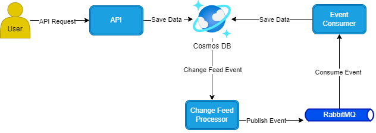
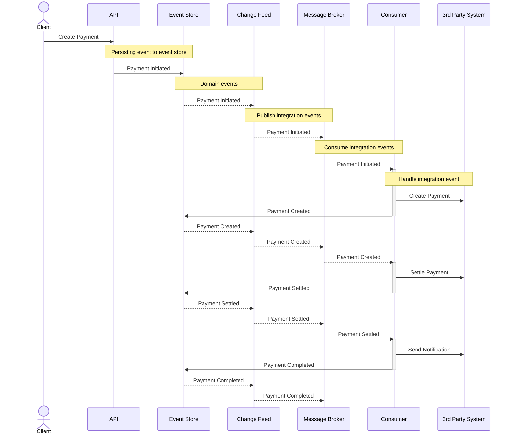
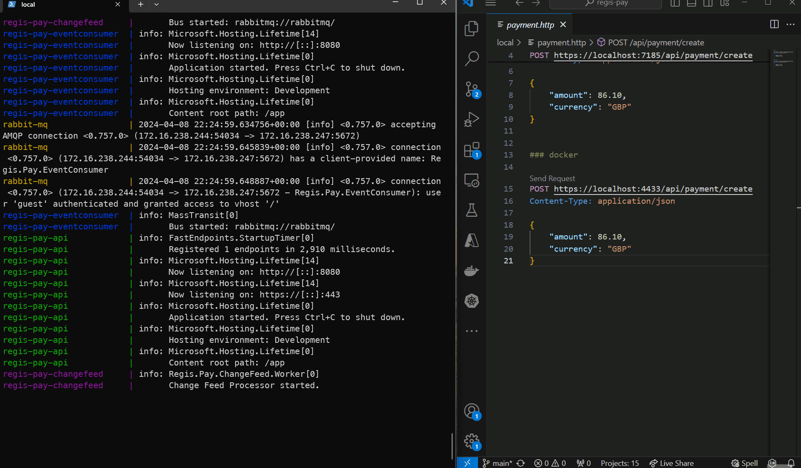
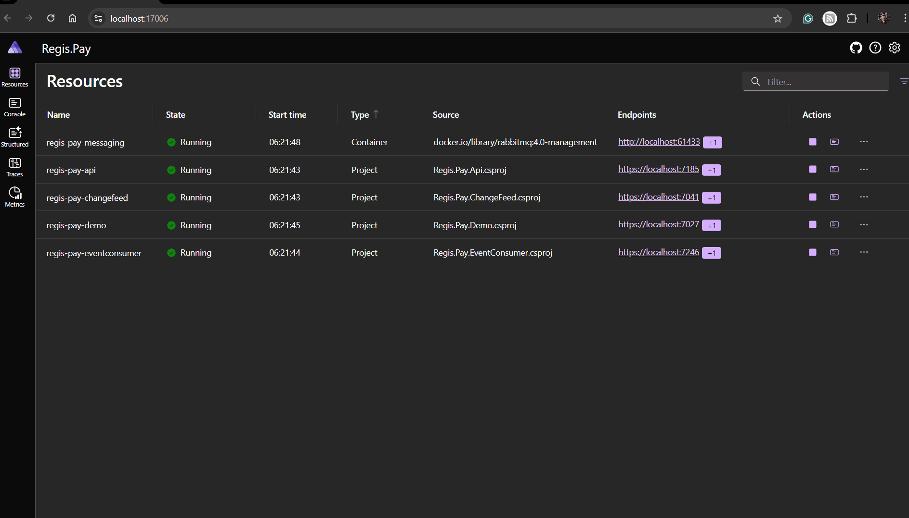

Regis Pay is fictional payment processor created as an example of a event-driven microservice architecture project built with dotnet, making use of the [Transactional Outbox pattern (with Azure Cosmos DB)](https://learn.microsoft.com/en-us/azure/architecture/databases/guide/transactional-outbox-cosmos) and [Event Sourcing pattern](https://learn.microsoft.com/en-us/azure/architecture/patterns/event-sourcing).

<br>
<br>
<br>

# Architecture

This diagram depicts the architecture of this solution.



- **API**: Represents the application programming interface that exposes endpoints for creating, updating, and deleting data.
- **Change Feed Processor**: Monitors changes to data (e.g., database records) and publishes events when changes occur.
- **Event Consumer**: Subscribes events and processes them (e.g., updating databases, sending notifications, etc.).

This sequence diagram shows how a payment would go travel through the system. 



All components have been added to make the clear distinction how a payment flows through this architecture 
The same components from the previous diagram are included below and the new ones have been marked with asterisk(*). 

- **API**: Represents the application programming interface that exposes endpoints for creating, updating, and deleting data.
- **Event Store***: Where event data is persisted. In this example project Cosmos DB, other databases are available.
- **Change Feed Processor**: Monitors changes to data (e.g., database records) and publishes events when changes occur.
- **Message Broker***: System used to forward on messages (integration events). Used the term Message Broker because RabbitMQ was used in this example, but this could easily be swapped out for servies like Azure Service Bus.
- **Event Consumer**: Subscribes events and processes them (e.g., updating databases, sending notifications, etc.).
- **3rd Party System***: Represents a thrid party system, either internally or externally.

# Getting Started

There are three ways to get started and up and running.

## Aspire

> [!NOTE]  
> This is setup with a locally installed version of the Cosmos DB emulator, but could be easily updated to use a Aspire version. It is mainly setup with a locally installed version.

### Prerequisites

- [Azure Cosmos DB Emulator](https://learn.microsoft.com/en-us/azure/cosmos-db/how-to-develop-emulator?tabs=windows%2Ccsharp&pivots=api-nosql#install-the-emulator)
- [Docker Desktop](https://www.docker.com/get-started/) - preferred docker solution used for .

### Steps

1. Set the `Regis.Pay.AppHost` project as the start up project and run.
1. (optional) Navigate to Demo project and create a payment.

## Docker Compose

> [!NOTE]  
> This is no longer maintained, it may need updating in order for it to work, use at your own discretion. Aspire is the recommend way to get started,

### Prerequisites

- [Docker Desktop](https://www.docker.com/get-started/) - preferred docker solution.

### Steps

1. `cd` into the `local` folder and run the [localSetup.ps1](local/localSetup.ps1) from your terminal. This is to setup the cert on API docker container for HTTPS support.

```
.\localSetup.ps1
```

2. Then run docker compose

```
docker-compose up --build
```

3. (optional) Navigate to `payment.http` file in the local folder and create a payment.

This should run all the services as-well as all the required dependencies in a pre-configured working state. 

## Visual Studio

### Prerequisites

The following prerequisites are required to build and run the solution. You can either install them individually or via docker:
- [Azure Cosmos DB Emulator](https://learn.microsoft.com/en-us/azure/cosmos-db/how-to-develop-emulator?tabs=windows%2Ccsharp&pivots=api-nosql#install-the-emulator)
- [RabbitMQ](https://www.rabbitmq.com/docs/download)

### Steps

1. Run the solution from Visual Studio, `Api`, `ChangeFeed` and `EventConsumer` should be set up as the start up projects.

## Manually Testing

Once up and running you can test the solution by using the [payment.http](local/payment.http) file to make a API request and observe the logs. As this solution uses CosmosDB and RabbitMQ, you can also inspect these systems to verify integration.

Here's an example gif showcasing the services running in docker and me manually submitting a payment request.



Observe the logs emitted as the payment goes through the services.

Alternatively if you have started the application via the Aspire host you can navigate to the demo project and create a payment from the demo UI.




## Technologies

Core infrastructure technologies in this solution are:

- [Azure Cosmos DB](https://azure.microsoft.com/en-gb/products/cosmos-db) - A NoSQL database for storing data. 
- [RabbitMQ](https://www.rabbitmq.com/) - A reliable and mature messaging and streaming broker.

## Nuget Packages

Notable packages used in this solution are:

- [MassTransit](https://masstransit.io/) - A framework that provides a abstraction on top of message transports, ie. in this example RabbitMQ. It can also be used with Azure Service Bus and Amazon SQS.
- [FastEndpoints](https://fast-endpoints.com/) - A developer friendly alternative to Minimal APIs & MVC.
